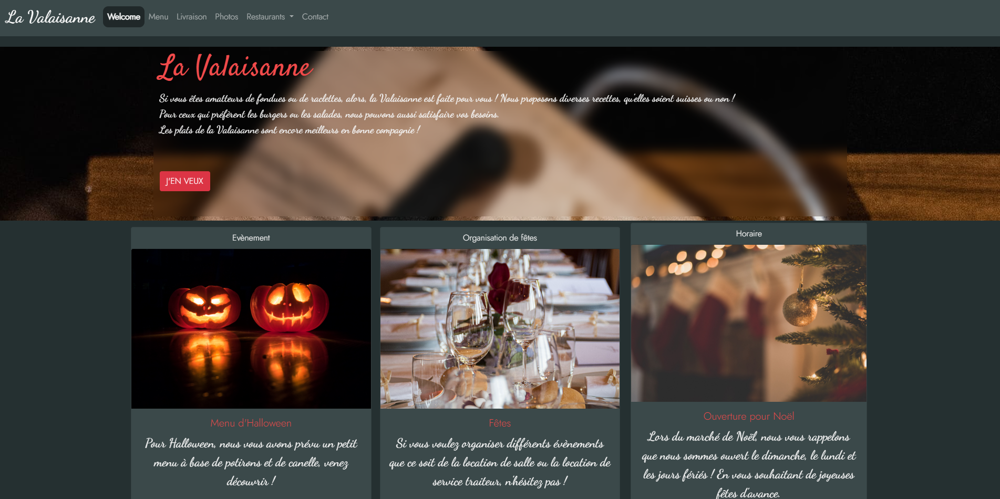

# Restaurant

Ce projet présente un site **HTML de 6 pages** (Index, Menu, Livraison, Photos, Restaurant et Contact) demandé dans le cadre de la formation BeCode Bruxelles, Classe Swartz-8.

## Live Version
Pour voir la page, c'est par ici : [Bienvenue!](https://fainteasy.github.io/restaurant.github.io/)

Un petit screenshot pour avoir une idée ? C'est parti ! 

## Tech Stack
Cette page HTML a été produite avec : 
- De l'**HTML** (sans blague)
- Du **CSS** et pas mal de BootStrap
- Un peu de **Javascript** sur certaine page, beaucoup pour la page livraison

## Authors

Gwendoline Jacobs.

[@Fainteasy](https://www.github.com/Fainteasy)
